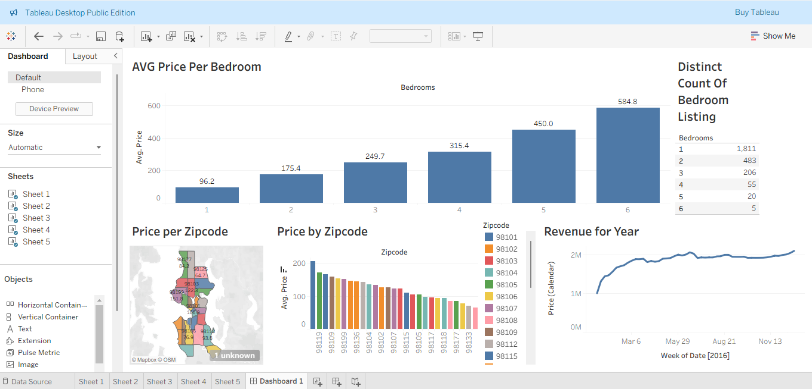

# Airbnb Data Analysis Dashboard using Tableau

## Project Overview
This project analyzes Airbnb listing data using Tableau to identify pricing trends, geographical distribution, bedroom availability, and yearly revenue patterns. The dashboard provides interactive visualizations that help users understand Airbnb market performance.

## Tools Used
- Tableau Public
- Microsoft Excel

## Dataset
The project uses the following datasets:
- listings.xlsx
- calendar.xlsx

## Dashboard Features
- Average Price per Bedroom
- Price by Zipcode
- Revenue Trend by Year
- Listing Distribution by Bedroom Count
- Interactive Dashboard Filters

## Key Insights
- Properties with more bedrooms generally have higher average prices.
- Pricing varies significantly across different zip codes.
- Revenue remains relatively stable throughout the year with slight growth.
- Most listings are concentrated in 1-bedroom properties.

## Dashboard Preview

## Files Included
- Airbnb_Tableau_project.twbx
- listings.xlsx
- calendar.xlsx
